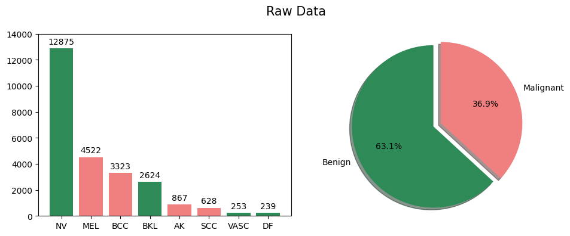

<h1>About SKIN-SCANCER Project 🔎</h1>

SKIN-SCANCER is an application designed and developed by a team of Le Wagon Data Science batch #1271 students to help users with their mole concerns.  

The goal of the application is to raise awareness of skin cancer and to guide users to make a right decision, such as consulting a dermatologist or keeping an eye on the development of the mole.

<h2 style='text-align: left'>Application:</h2>
<a href='https://skin-scancer.streamlit.app/'>Rita Bastos</a>

<h2 style='text-align: left'>Team Members:</h2>
            <ul stype='font-size:5;'>
            <li><a href='https://github.com/RitaBastosRG'>Rita Bastos</a></li>
            <li><a href='https://github.com/HelloSunPKU2023'>Haitao Sun</a></li>
            <li><a href='https://github.com/yt50'>Yui Takeuchi-Schöpe</a></li>
            <li><a href='https://github.com/InesBelhadjSoulami'>Ines Bel Hadj Soulami</a></li>
            </ul>

<h1>About Dataset 📁</h1>

The dataset we used to train and test our model is <a href='https://www.kaggle.com/datasets/salviohexia/isic-2019-skin-lesion-images-for-classification'>ISIC 2019 Skin Lesion images for classification </a> available on Kaggle.

There are 8 categories of skin cancers or moles in the dataset:
<ul>
<li><strong>Malignant (Cancerous)</strong>
  <ul>
  <li>MEL: Melanoma</li>
  <li>BCC: Basal cell carcinoma</li>
  <li>AK: Actinic keratosis</li>
  <li>SCC: Squamous cell carcinoma</li>
  </ul>
</li>
<li><strong>Benign (Harmless)</strong>
  <ul>
  <li>NV: Melanocytic nevus</li>
  <li>BKL: Benign keratosis (solar lentigo / seborrheic keratosis / lichen planus-like keratosis)</li>
  <li>DF: Dermatofibroma</li>
  <li>VASC: Vascular lesion</li>
  </ul>
</li>

The dataset is imbalanced. We augumented the data to tackle the imbalance.

<h1>About Model 🦾</h1>
We used a pretrained model (<i>Resnet50</i>) for this project.

<i>Resnet50</i> is a Convolutional Neural Network model with 50 layers.  
                  We adjusted the model to our specific tasks, shown as below:  
                    <ol type="1">
                    <li>Pretrained model</li>
                    <li>Input layer</li>
                    <li>Random zoom layer</li>
                    <li>Non-trainable layer</li>
                    <li>Flattening layer</li>
                    <li>Dense layer</li>
                    <li>Dropout layer</li>
                    <li>Prediction layer</li>
                    </ol>
                   Optimizer is Adam with learning rate of 1e-6.
                    

